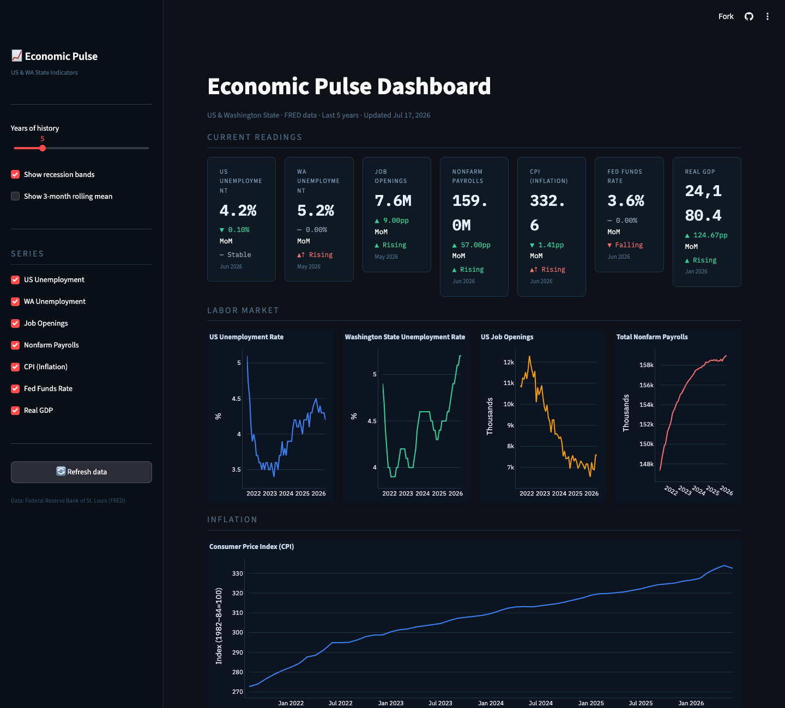

# Economic Pulse Dashboard

A Python data pipeline that fetches, cleans, and visualizes key US and Washington State economic indicators from the FRED API, then serves them as an interactive Streamlit dashboard. It handles the full path from raw API pull to charted output: caching, validation, derived metrics, and NBER recession context.


**Live demo:** *https://tarang-tj.github.io/economic-pulse-dashboard/*



---

## What It Does

| Stage | What happens |
|-------|-------------|
| **Extract** | Pulls 7 macroeconomic time series from the FRED REST API with local 12-hour caching |
| **Transform** | Cleans missing values, casts types, computes YoY changes and rolling statistics with pandas |
| **Analyze** | Detects short-term trends via linear regression, builds correlation matrix, flags recession periods, forecasts 6 months ahead with ARIMA(1,1,1) |
| **Load** | Renders an interactive Streamlit dashboard with Plotly charts |

---

## Indicators Tracked

| Series | Description |
|--------|-------------|
| `UNRATE` | US Civilian Unemployment Rate |
| `WAUR` | Washington State Unemployment Rate |
| `JTSJOL` | US Job Openings (JOLTS) |
| `PAYEMS` | Total Nonfarm Payrolls |
| `CPIAUCSL` | Consumer Price Index (Inflation) |
| `FEDFUNDS` | Federal Funds Rate |
| `GDPC1` | Real GDP |

---

## Tech Stack

- **Python 3.11+**
- **pandas** — data cleaning, resampling, rolling statistics
- **requests** — FRED API integration
- **scipy** — linear regression for trend detection
- **statsmodels** — ARIMA(1,1,1) forecasting with 80%/95% confidence intervals
- **plotly** — interactive time series charts and heatmaps
- **Streamlit** — dashboard framework

---

## Project Structure

```
economic-pulse-dashboard/
├── app.py              # Streamlit dashboard (entry point)
├── pipeline.py         # ETL: fetch → validate → clean → cache
├── analysis.py         # Derived metrics: trends, correlations, stats
├── forecast.py         # ARIMA(1,1,1) forecasting with confidence intervals
├── config.py           # Series definitions and constants
├── index.html          # Static demo page (GitHub Pages)
├── tests/              # pytest suite (no network/API key required)
├── requirements.txt
└── .gitignore
```

---

## Setup

### 1. Clone the repo
```bash
git clone https://github.com/tarang-tj/economic-pulse-dashboard.git
cd economic-pulse-dashboard
```

### 2. Create a virtual environment
```bash
python -m venv venv
source venv/bin/activate        # macOS/Linux
venv\Scripts\activate           # Windows
```

### 3. Install dependencies
```bash
pip install -r requirements.txt
```

### 4. Get a free FRED API key
1. Go to [https://fred.stlouisfed.org/docs/api/api_key.html](https://fred.stlouisfed.org/docs/api/api_key.html)
2. Create a free account and request an API key

### 5. Set up your environment
```bash
# Create a .env file in the project root with your key
echo "FRED_API_KEY=your_key_here" > .env
```

### 6. Run the dashboard
```bash
streamlit run app.py
```

---

## Key Design Decisions

**Caching layer** — API responses are cached as local JSON for 12 hours (`pipeline.py`). This avoids hammering the FRED API during development and makes the app responsive.

**Trend detection** — Uses `scipy.stats.linregress` over a 6-month rolling window. A trend is only flagged if the regression is statistically significant (p < 0.10) and explains at least 30% of variance (R² ≥ 0.3). This avoids noisy false signals.

**YoY change logic** — For rate series (unemployment, fed funds), YoY is expressed as percentage-point change. For index/level series (CPI, GDP), it's expressed as a percentage change. This distinction matters for correct interpretation.

**Recession shading** — NBER-dated recessions are overlaid as translucent bands on all time series charts, making cyclical context immediately visible.

**ARIMA forecasting** — `forecast.py` fits `statsmodels` ARIMA(1,1,1) on each monthly series and projects 6 months ahead, reporting 80% and 95% confidence intervals plus the fitted model's AIC. Series with fewer than 24 clean monthly observations, or a fit that fails to converge, raise a clear error instead of silently returning numbers — no fallback to fabricated forecasts. Toggle it in the sidebar as "Show 6-month ARIMA(1,1,1) forecast".

---

## Deploy to Streamlit Community Cloud (Free)

1. Push this repo to GitHub
2. Go to [share.streamlit.io](https://share.streamlit.io)
3. Connect your repo
4. Add `FRED_API_KEY` as a **Secret** in the app settings
5. Deploy — your app gets a public URL instantly

---

## Extending the Project

Ideas for future enhancements:
- Add state-level comparisons beyond Washington (California, Texas, etc.)
- Pull BLS industry employment breakdowns
- Email/Slack alerts when an indicator crosses a threshold
- Deploy as a scheduled pipeline with Prefect or Airflow

---

## Data Source

All data sourced from the [Federal Reserve Bank of St. Louis (FRED)](https://fred.stlouisfed.org/). Free for personal and commercial use.

---

*Built by [Tarang (TJ) Jammalamadaka](https://tarang-tj.github.io) · [LinkedIn](https://linkedin.com/in/tarang-tj) · [GitHub](https://github.com/tarang-tj)*
